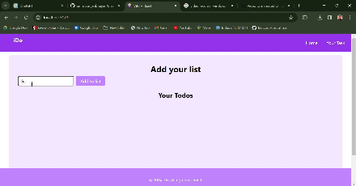

# TodoList App


This TodoList app allows users to manage their daily tasks efficiently. Users can add, edit, mark as completed, and delete tasks as needed. The application is built using React.

## Features

- **Add Todos**: Users can add new tasks by typing them into the input field and clicking the "Add to list" button.
- **Edit Todos**: Users can edit existing tasks by clicking the "Edit" button, modifying the task, and then clicking the "Update" button.
- **Mark as Completed**: Users can mark tasks as completed by checking the checkbox next to each task.
- **Delete Todos**: Users can delete tasks by clicking the "Delete" button next to each task.
- **Persistent Storage**: Todos are stored locally using browser storage, so users can access their tasks even after refreshing the page.

## Usage

1. Clone the repository to your local machine.

2. Navigate to the project directory.

3. Install dependencies using npm or yarn.

4. Run the application.
or

5. The TodoList app should open in your default web browser.

## Technologies Used

- React
- JavaScript
- HTML
- tailwind css

## Folder Structure

```
todolist-app/
│
├── public/
│ ├── index.html
│ └── ...
│
├── src/
│ ├── components/
│ │ ├── Navbar.js
│ │ ├── Footer.js
│ │ └── ...
│ ├── App.css
│ ├── App.js
│ └── index.js
│
├── .gitignore
├── package.json
└── README.md
```